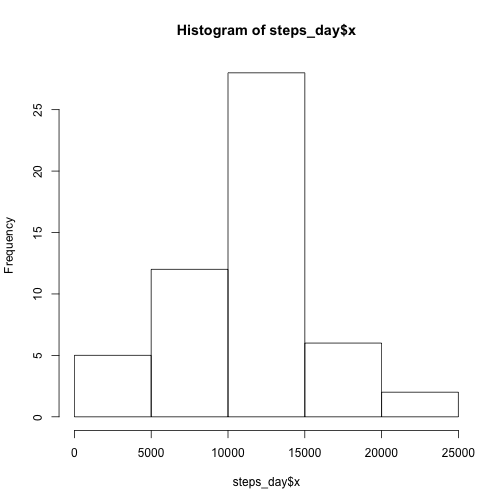
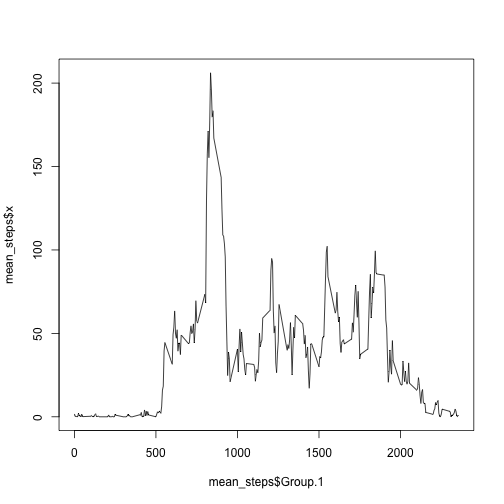
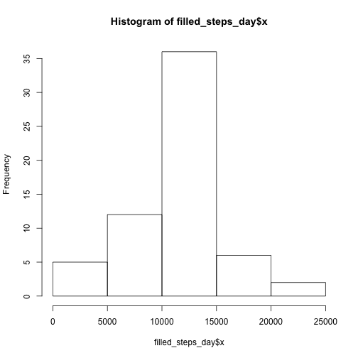
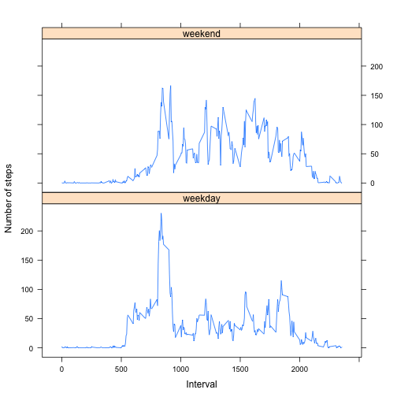

# Analysis of Activity Monitoring Device for a Two Day Period

## Loading and preprocessing the data

We omit any interval for which there is no `steps` information:


```r
unzip("activity.zip")
steps_orig <- read.csv('activity.csv')
steps <- na.omit(steps_orig)
```

## What is mean total number of steps taken per day?

The total number of steps per day is shown below in tabular format.


```r
steps_day <- aggregate(steps[,c("steps")], by=list(steps$date), "sum")
steps_day
```

```
##       Group.1     x
## 1  2012-10-02   126
## 2  2012-10-03 11352
## 3  2012-10-04 12116
## 4  2012-10-05 13294
## 5  2012-10-06 15420
## 6  2012-10-07 11015
## 7  2012-10-09 12811
## 8  2012-10-10  9900
## 9  2012-10-11 10304
## 10 2012-10-12 17382
## 11 2012-10-13 12426
## 12 2012-10-14 15098
## 13 2012-10-15 10139
## 14 2012-10-16 15084
## 15 2012-10-17 13452
## 16 2012-10-18 10056
## 17 2012-10-19 11829
## 18 2012-10-20 10395
## 19 2012-10-21  8821
## 20 2012-10-22 13460
## 21 2012-10-23  8918
## 22 2012-10-24  8355
## 23 2012-10-25  2492
## 24 2012-10-26  6778
## 25 2012-10-27 10119
## 26 2012-10-28 11458
## 27 2012-10-29  5018
## 28 2012-10-30  9819
## 29 2012-10-31 15414
## 30 2012-11-02 10600
## 31 2012-11-03 10571
## 32 2012-11-05 10439
## 33 2012-11-06  8334
## 34 2012-11-07 12883
## 35 2012-11-08  3219
## 36 2012-11-11 12608
## 37 2012-11-12 10765
## 38 2012-11-13  7336
## 39 2012-11-15    41
## 40 2012-11-16  5441
## 41 2012-11-17 14339
## 42 2012-11-18 15110
## 43 2012-11-19  8841
## 44 2012-11-20  4472
## 45 2012-11-21 12787
## 46 2012-11-22 20427
## 47 2012-11-23 21194
## 48 2012-11-24 14478
## 49 2012-11-25 11834
## 50 2012-11-26 11162
## 51 2012-11-27 13646
## 52 2012-11-28 10183
## 53 2012-11-29  7047
```

The histogram of the total number of steps taken each day is shown below:


```r
hist(steps_day$x)
```

 

The mean of the total number of steps taken per day is 1.0766189 &times; 10<sup>4</sup> and the median is 10765.

## What is the average daily activity pattern?

The plot of the 5-minute interval and the average number of steps taken is shown below:


```r
mean_steps <- aggregate(steps[,c("steps")], by=list(steps$interval), "mean")
plot(mean_steps$Group.1, mean_steps$x, type = "l")
```

 

The 835 is the 5-minute interval with the maximum number of steps.

## Imputing missing values


```r
filled_steps <- steps_orig
na_intervals <- is.na(filled_steps$steps)
```

The total number of missing values is 2304.

The missing values are filled in by taking the mean from similar intervals as shown below.


```r
for (i in which(na_intervals)) {
    mean_value = mean_steps[mean_steps$Group.1 == filled_steps$interval[i],]
    filled_steps$steps[i] <- round(as.numeric(mean_value$x))
}

filled_steps_day <- aggregate(filled_steps[,c("steps")], by=list(filled_steps$date), "sum")
```

The histogram below shows the total number of steps taken each day once the missing values have been filled in.


```r
hist(filled_steps_day$x)
```

 

The new mean of the total number of steps taken per day is 1.0765639 &times; 10<sup>4</sup> and the new median is 1.0762 &times; 10<sup>4</sup>.

There is a very small difference between the mean and median values obtained by filling in missing values and the original ones that do not take them into account.

## Are there differences in activity patterns between weekdays and weekends?

The plot below shows the 5-minute interval and the average number of steps taken, averaged across all weekday days or weekend days. There seems to be more activity during the weekends and it is distributed more evenly accross the active intervals.


```r
library(lattice)
filled_steps$day <- ifelse(weekdays(as.Date(filled_steps$date)) %in% c("Saturday", "Sunday"), "weekend", "weekday")
filled_mean_steps <- aggregate(filled_steps[,c("steps")], by=list(filled_steps$interval, filled_steps$day), "mean")
xyplot(x ~ Group.1 | Group.2,
    data = filled_mean_steps,
    layout = c(1,2),
    type = "l",
    xlab="Interval",
    ylab="Number of steps",
)
```

 
